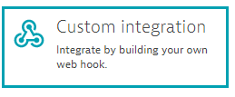

# Custom Webhook for Dynatrace notifications

This is a sample python application that works as a custom webhook with Dynatrace. The webhook runs as a [Flask Microservice](http://flask.pocoo.org/) that handles problem notifications (POST requests) coming from Dynatrace (SaaS or Managed). In this sample application there are different use cases shown like calling a legacy executable on the host (use case taken from a Bank), showing and polling the problem feed via the webserver, commenting the results of the integrations in the dynatrace problem or sending an SMS notification. The idea is that you understand this application and use it as a template, understand how the [Dynatrace API](https://www.dynatrace.com/support/help/dynatrace-api/ "Dynatrace API")  works, specially the [problem API](https://www.dynatrace.com/support/help/dynatrace-api/problems/what-does-the-problems-api-provide/) so you can build your own integration the way you need it: be it a plain notifications integration, a CMDB synchronization or even a self-healing system.

## Getting started
These instructions will get you a copy of the project up and running on a windows or linux machine.

### Prerequisites
* Python runtime (with pip): [Download](https://www.python.org/downloads/)
* Dynatrace Tenant: [Get your Saas Trial Tenant](https://www.dynatrace.com/trial/)
* Twilio Account (optional for sending SMS): [Get your Twilio free trial](https://www.twilio.com/)

### Installing
For installing the Webhook in your machine you only need to clone the repository and then download the python dependencies with pip.

#### Download the repository

	git clone https://github.com/Dynatrace/Custom-Webhook-Python.git

#### Download and install the requirements with pip
Go to the main directory (webhook) and install the python project dependencies by running the following command from the terminal:

	pip install -r requirements.txt

#### Set up your configuration
before running the Flask Web Microservice, we should configure some small things. The webhook configuration is saved in a JSON file named `config.json`. In here you will configure the webhook for your environment, meaning the URL of your Dynatrace Tenant and the API Token used for allow communication with Dynatrace. 

##### Description of `config.json`:

	{
		"dynatrace": {
			"tenant": "https://xxxxxxxx.live.dynatrace.com",	URL of Dynatrace SaaS or Managed
			"api_token": "YOUR_API_TOKEN"				API Token for problem notifications
		},
		"webhook": {
			"username": "dynatrace",		User for custom notification
			"password": "s3cr3t",			Password for custom notification
			"interface": "0.0.0.0",			Interface where the webhook should listen to. Default all interfaces. 
			"port": 5000				Port where the webhook listens for communication.
		},
		"dir_received": "problems_received",		Folder to save the problems when received.
		"dir_sent": "problems_sent",			Folder to save the problems details after being sent.
		"log_dir": "log",				Log folder 	
		"log_file": "webhook.log",			Log file
		"incident_notification": {						
			"active": true,				Legacy notification flag. Default true (possible values true/false)
			"exec_win": "legacy_script.bat",	Windows legacy executable (simulation). It can be also an .exe
			"exec_unix": "legacy_script.sh"		Linux legacy executable (simulation). It can also be an .so
		},
		"sms_notification": {
			"active": false,					SMS notification (posible values true/false)
			"twilio_account":"AC027e8af87e11d3f080bXXXXXXXXXXX",	Twilio Account
			"twilio_token":"2e3070021e718067df2b2dXXXXXXXXXX",	Twilio API Token
			"twilio_number": "+18652699XXX",			Twilio Number (sent from)
			"to_number": "+49170XXXXXXX"				Number to notify (sent to)
		}
	}

##### Minimal set up in config.json

- add your Dynatrace tenant URL
- add the API Token *(Log into your Dynatrace environment and go to Settings > Integration > Dynatrace API. Generate a new access token by typing a unique string into the Key label field, then click the Generate key button)*

## Running the webhook

### Starting the webserver
Now we are all set to run the webhook. You downloaded the repository, installed python and it's dependencies and entered your configuration, now lets test it!

Call the webhook.py application from the console with the parameter "run" to start the webserver.

	$> python webhook.py run

	Dynatrace Custom Webhook Integration
	----------------------------------------------
	
	Starting the Flask Web Microservice
	 * Running on http://0.0.0.0:5000/ (Press CTRL+C to quit)

You'll see a message in the console that the web server is up & running and listening on port 5000. If you go to your browser and call http://localhost:5000 you'll become a response similar like this:

You'll be able to see the runtime status of the application like runtime parameters and how many problems it has received and how many problems have been integrated to other systems (legacy script and/or sms). 

### Poll the problem feed from the webserver 

You can test the Dynatrace API and fetch the [Problem Feed](https://www.dynatrace.com/support/help/dynatrace-api/problems/how-do-i-fetch-the-complete-list-of-problems/) for a specific time range. The time ranges supported are: hour, 2hours, 6hours, day, week and month. 

In the browser you'll see the time range displayed in buttons. If you click on one it will send an HTTP GET request to the Flask Microservice with a parameter for example to poll all problems of the week: `http://localhost:5000/?relativeTime=week` this request will be handled by the python application and it will then poll the problem API subsequently.

### Bind Dynatrace to the custom webhook

Ok, until now we successfully checked that the webhook can connect to Dynatrace and can poll problem information through the API. These are actually extra features, the webhook is listening to incoming connections on the port 5000. 
We now have to bind the Dynatrace Cluster to the webhook.

You now go to your tenant in `Dynatrace > Settings > Integration > Problem notifications` and select custom notification.

Now you have to fill in the following information:

**Name**
This is kind of obvious, put in the name you want for your custom webhook ;)

**Webhook URL**
The webhook URL might be tricky to get if you are running the webhook in your laptop and you want for example that Dynatrace connects to it via the internet. You'll need to first figure out the dynamic IP assigned to your router by your ISP and might also need to configure your home router to open a port and forward the incoming traffic to the listening port in your local machine where you are running the webhook. This is a different topic but I'll let a [blogpost](https://www.howtogeek.com/66214/how-to-forward-ports-on-your-router/) that can help you understand and set up that environment. But hey! before you open a security leak in your home network, or are short in time, you might want to give it a try to spin up a VM in a cloud provider like [Azure ](https://azure.microsoft.com/en-us/free/)or [AWS](https://aws.amazon.com/free/). You can spin up a VM in the sizing you need it within minutes with a DNS name bound to it.
If you are running the webhook in a corporate network, then you just need to make sure the port and IP's from the Dynatrace Cluster and the Webhook are open within the internal firewall. 

**Additional HTTP Headers** The webhook supports basic authorization, in here you put the username and password that are defined in the `config.json` file, type it in and click add. 

**Custom Payload** In here you define the JSON format that is going to be sent to the custom webhook. Since this sample is for educational purpouses, we only need `State, ProblemID and PID` and the webhook will poll the problem details when receiving a message.

Here is the format so you can copy&paste it:

	{
	"State":"{State}",
	"ProblemID":"{ProblemID}",
	"PID":"{PID}"
	}

After you have entered the parameters where the webhook is running, click on send notification to send a test message to the webhook. You should see an integration test successful message.  

Also in the console or log of the webhook you should be able to see that the test message arrived succesfully. The test message is also saved in the `problems_received` folder.
 
    Notification received from 54.XXX.XXX.XXX
    Test message successfully received. No integration will be called
    54.XXX.XXX.XXX - - [29/Mar/2018 15:51:07] "POST / HTTP/1.1" 200 -

As an optional configuration you can assign an alerting profile to the webhook so you only receive notifications for specific severities, criterias, services, hosts, etc.

Ok, you are all set! Now your webhook should get in action after a problem its detected.

## Understanding the project
This sections describes the features and integrations.

### Features of the webhook in a Nutshell
- Handle POST requests coming from Dynatrace (with basic authentication user & password)
- Logging
- Configuration via a config.json file
- Save the incoming and outgoing (problem details) notifications as JSON files
- Poll a specific problem by ID
- convert JSON payload in an html table
- Poll a range of problems in a specific timeframe (via command line or webserver)
- Integration with legacy systems: call a legacy executable for each impacted entities a problem has with parameters
- Integration with SMS: send an SMS via Twilio API
- POST the results of the integration in the problem comments in Dynatrace
- Exposing a web server with the runtime information of the webhook
- Poll the problem API in a specific time range (either by command line or via webserver).
- Show the sent and received problems as an HTML table

### Project structure & description

	└─ webhook
		├─  doc
		│	└── ...			Documentation folder with images.
		├─  log				Folder for logging (specified in config.json)
		│	└── webhook.log		Logging file (specified in config.json)
		│
		├─  problems_received   	Folder for saving the notifications as a JSON payload without preprocessing.
		│	└── [0-9]-[STATE].json
		├─	problems_sent		Folder for saving the notifications (problem_details) that were succesfully polled and submitted to the integrations. 
		│      └── [0-9].json
		├─	templates			
		│		└── index.html	Flask rendering template for the Webhook webserver.
		├─	config.json		Configurations file
		├─	legacy_script.bat	Legacy sample executable for Windows.
		├─	legacy_script.sh	Legacy sample executable for Linux.
		├─	README.md		This ReadMe file
		├─	requirements.txt	python project dependencies
		└─	webhook.py		The custom Webhook application

### Integrations
This project has two integrations, calling an executable with parameters where the webhook is running and send an SMS via the Twilio API. The project is created in a way so you can get a glimpse of the integration capabilites with dynatrace and you can build your own integration. 

#### Legacy Script / Incident Software
In the `config.json` file there is a section called **incident notification**. In here you can activate with a boolean flag the execution of the legacy_script.[bat/sh]. This script will be called with parameters after a notification arrives. The return code of the executable will then be posted in the comment section of the problem in Dynatrace.

#### Send an SMS via Twilio API
In the `config.json` file there is a section called **sms notification**. If you set up this integration to true, then it will send an SMS to the given phone in the configuration. You'll need a valid account in twilio for this integration to work. [Here ](https://www.twilio.com/try-twilio) you can set up a free trial Account. 

#### Create your own integration
You can use this project as a template. For start creating your own integration check the Python code `webhook.py` for a function called `call_integration`. This function is the binding of the Integrations with the received problem (with its problem details). In here you can expand the project and start coding your own integration. 

## License
This project is licensed under the Apache License - see the [LICENSE](LICENSE) file for details

## Who do I talk to? ##

If this project gave you some new ideas or might help you or your customers, then that's awesome! If you think we can be of any help, don't hesitate to reach out!

* You can always reach out to me [sergio.hinojosa@dynatrace.com](mailto:sergio.hinojosa@dynatrace.com) or my team in [dach.se@dynatrace.com](mailto:dach.se@dynatrace.com)